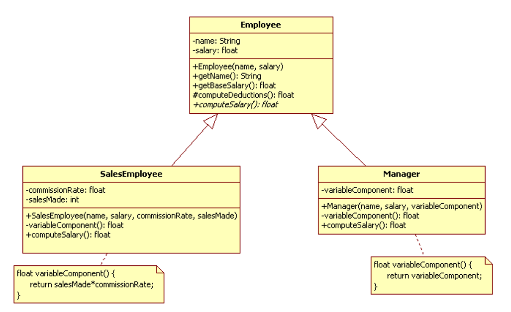

***Introduction***

A Human Resource Application design is given in Figure 1, and the partial code for Employee, SalesEmployee and Manager classes are given below the figure.

***How would you improve this code ?***
Refactor the code to make it 'better'

***Using Gen-AI***

1.	Use the GitHub Co-pilot plugin that you have installed in your IDE to verify your answer.

2.	Don’t hesitate to change your ‘Prompt’ to improve the accuracy of your prompt.

